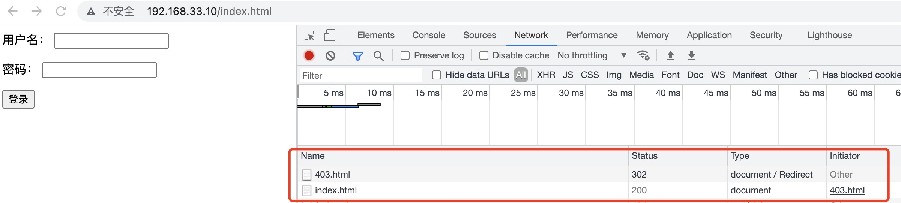
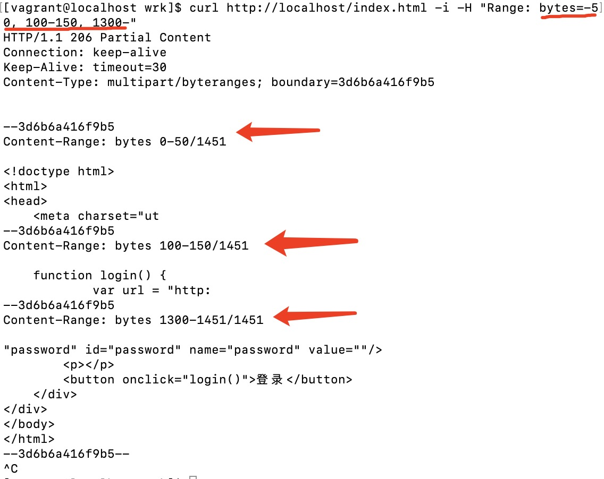
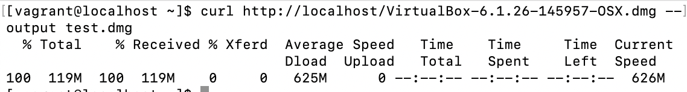
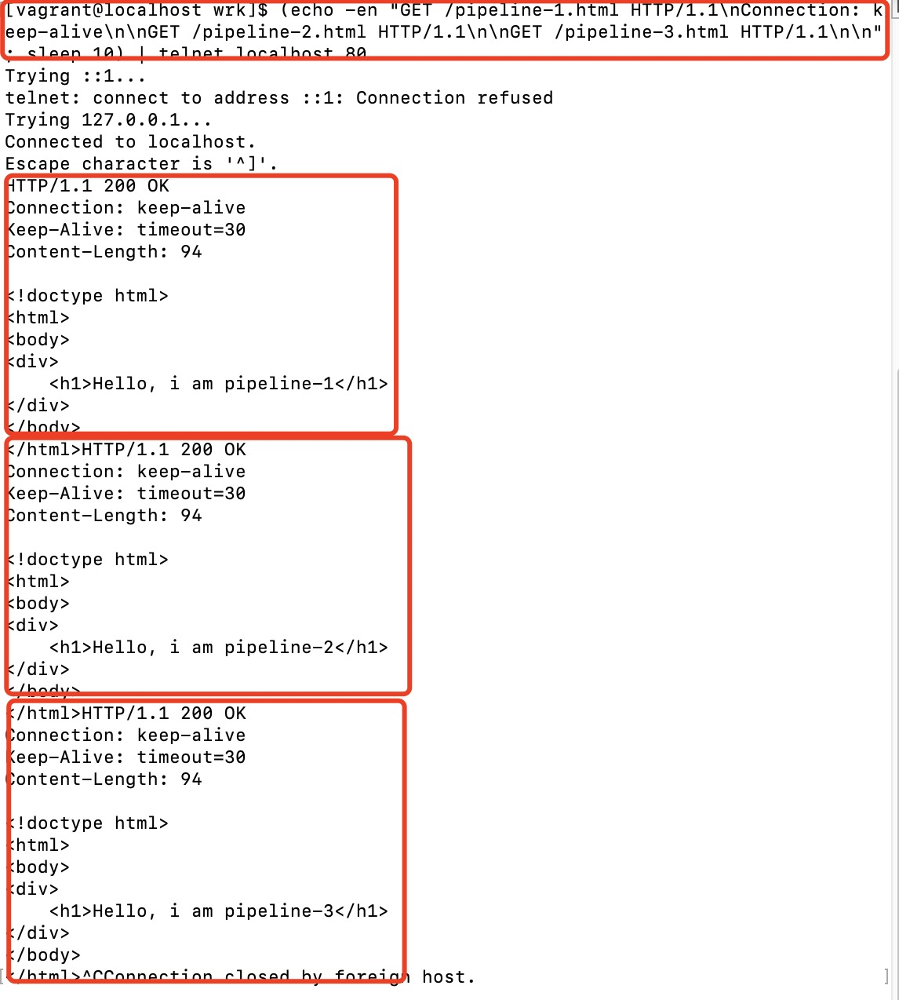
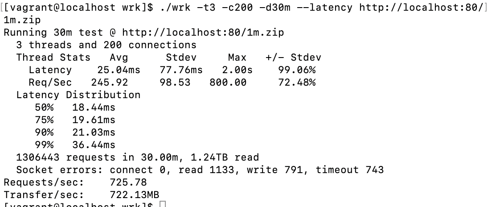
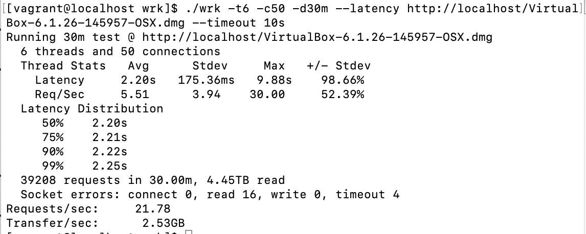

# cpp http server

## 背景

背景:刚入职虾皮是的入职作业，使用c++实现高性能http服务器
目标:实现http get方法请求的解析和响应

## 目录结构

- http_server.h http服务器，事件驱动模型处理请求
- io.h          socket读写实现
- log.h         日志实现
- main.cpp      程序入口
- request.h     http请求定义
- response.h    http响应定义

## 程序设计

- HttpApplication，启动类，初始化监听/epoll，阻塞等待epoll事件并将事件分发给HttpHandler处理。
- HttpHandler，http请求处理类，处理epoll读写事件
- HTTPRequest，http请求对象，保存了解析后的http请求
- HTTPResponse，http响应对象，记录了文件的偏移量、range、chunk等信息。
- HttpHeader，http响应的Header builder。

## 功能实现

**只支持http1.1协议，get请求**

### 进阶项目

支持http chunk

- 当下载文件大于某个阈值时，服务端使用chunk编码返回数据

重定向功能

- 状态码返回302，header添加Location字段即可。

支持http range请求

- 直接使用ifstream.seekg(2)函数定位到请求的文件范围，再数据返回

大文件传输

- 分多次从文件读取内容再多次写入socket即可

keep-alive

- 在响应完一个请求后，不立即关闭tcp连接，而是将epoll事件修改为EPOLLIN，等待下一个请求到来。
- 使用timerfd作为定时器纳入epoll管理，当时间到达会触发EPOLLIN事件，然后遍历长连接容器，关闭空闲连接。

pipeline

- 在解析http请求时，当解析完一个请求，但是从socket拿到的数据还有剩，判断为pipeline请求，将会继续解析请求并使用链表结构按顺序保存解析的请求结果。
- 解析完所有请求后，会从链表头遍历到链表尾部，一个个地处理请求并返回响应。

## 功能测试

### 302

### range

### 100M文件下载

### 长连接 & pipeline

## 性能测试

###  1MB大小文件

### 100MB文件

## 后续优化

- range和chunk兼容
- http头边界情况处理
- 半关闭处理
- 长连接精确的超时判断
- 多重range时Content-Length问题
